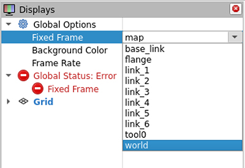
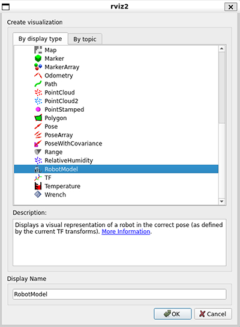
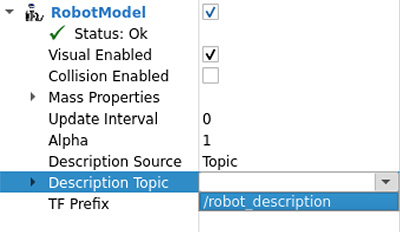
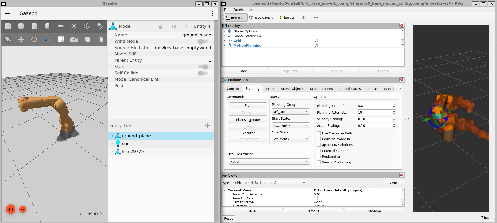

# Getting Started
{: .no_toc }

If you haven't already, please finish all of the required [installation](installation.html) steps.

The following guide will get you started with robotic fabrication on the FABLab's KUKA KR 6 robots.

## Table of contents
{: .no_toc .text-delta }

1. TOC
{:toc}

----

## Code repository

All of the files and code you will need to get started are located in `src` folder of the [GitHub repository] (also linked at the top right of each page). You can download the entire repository under `Code > Download ZIP` or you can [click here](https://github.com/ADRLaboratory/robotic_fabrication_w23/archive/refs/heads/main.zip). You can also use [git] if you are familiar with it (although we won't be covering git here).

{: .note }
> `src` is short for "source" or "source code"

Make sure to unblock the ZIP file before extracting! (`Right click > Properties > Unblock`)

----

## Create a ROS workspace

Recall that we will be working with ROS through WSL. Open up a WSL terminal and run these commands:

```shell
echo "source /opt/ros/humble/setup.bash" >> ~/.bashrc
echo "export LIBGL_ALWAYS_SOFTWARE=1" >> ~/.bashrc
mkdir -p ~/kr6/src
cd ~/kr6
colcon build
```

{: .note }
> If you are unfamiliar with UNIX commands / Shell scripting and would like to learn more, you can go through [this tutorial](https://www.tutorialspoint.com/unix/index.htm).
>
> In short, `echo "..." >> ~/.bashrc` saves a command to your `.bashrc` file, which executes each time your terminal opens. The first command sources (runs) the file `setup.bash` in the ROS package, which tells the terminal which directories to look at for locating ROS libraries. The second command configures WSL to enable graphics, which will be important later.
>
> The remaining commands creates a working directory `kr6` with the subfolder `src`, and builds an empty package (this will create some additional folders).

We will now open this workspace in VS Code, which has terminal functionalities built-in so you will no longer need to use a separate WSL terminal.

In VS Code, make sure you have the [WSL extension installed](installtion.wsl.html#vs-code).

Open the Command Palette (`Ctrl + Shift + P`) and run `WSL: Open Folder in WSL...`. Navigate and select the `kr6` folder you just made (`Ubuntu > home > <username> > kr6`).

To open a terminal in VS Code, go to `Terminal > New Terminal` or use the shortcut `` Ctrl + Shift + ` ``. This terminal will work exactly the same ways as the WSL terminal you used previously.

Whenever you open a new terminal in the ROS workspace, make sure to source `install/setup.bash`:

```shell
source install/setup.bash
```

{: .note }
> Similar to how we sourced the `setup.bash` from the ROS package previously, this `setup.bash` tells the terminal where our local package files are. However, we don't want to add this to `~/.bashrc` to run automatically every time since you won't always be working with a local workspace that has a `install/setup.bash` file.

----

## Build ROS packages

Included in the provided code are three packages:
- `kr6_base_description` includes the [URDF] and mesh geometry of the KR 6 robots.
- `kr6_base_gazebo` includes the files required for running a [Gazebo] physics simulation environment.
- `kr6_base_moveit_config` includes the [MoveIt 2] motion planning and semantics files.

You will need to copy these packages (their folders) into the `src` folder of the ROS workspace.

To do this, open Windows File Explorer and at the bottom of the left side bar you should see that WSL added a Linux shortcut. Navigate from there through `Ubuntu > home > [username] > kr6 > src`. You can now copy/paste the downloaded folders here.

Build the packages with the following command (all of the remaining commands can be run from a VS code terminal in the ROS workspace):

```shell
colcon build --symlink-install
```

{: .note }
> `--symlink-install` here is a tag that tells the package builder, colcon, to create a symbolic link to your source code. This means that for non-compiled files (such as XML, Python, etc.) the package contents will automatically update when you make changes in the source code, without you having to rebuild the entire package.
>
> You will still need to run this command again whenever you create new files that need to be added to the package.

{: .troubleshoot }
> Remember to `source install/setup.bash` first if you are in a new terminal!

----

## RViz visualization test

To test if the packages built correctly, we'll launch [RViz], a built-in graphical interface for ROS, and load in our robot.

```shell
ros2 launch kr6_base_description display.launch.py
```

{: .note }
> We will be using the `launch` command frequently, so it is useful to understand how it works.
>
> `ros2 launch` defines the command you are running (launching a file in ROS 2).
>
> The next parameter describes the package where the launch file is located, in this case `kr6_base_description`. The command will look for launch files in the `launch` folder of the package.
>
> The last parameter is the name of the launch file, which is typically written in Python, XML, or YAML. The launch file contains instructions for which ROS 2 nodes to create and with what paremeters.

{: .troubleshoot }
> If you get an error `[rviz2-3] qt.qpa.xcb: could not connect to display`, you may need to update WSL. In **administrator** PowerShell or Windows Command Prompt:
>
> ```shell
> wsl --update
> wsl --shutdown
> ```
>
> Then open a WSL terminal to restart WSL.

This command will open RViz and a Joint State Publisher GUI.

To display the robot, first we need to define the global frame. Under `Global Options`, select the dropdown for `Fixed Frame` and change it to `world`.



At the bottom left, select `Add` then `RobotModel`.



Under the newly added `RobotModel`, select the dropdown for the `Description Topic` and change it to `/robot_description`.



You should now see the robot geometry in RViz and manipulate its joints using the sliders in the Joint State Publisher GUI!

{: .note }
> One of the nodes launched in the `display.launch.py` file is the Robot State Publisher (RSP) which publishes the robot's URDF to a topic called `/robot_description`. What RViz is doing is subscribing to that topic to then retrieve that URDF and visualize the robot.

To close any running processes, use `Ctrl + C` in the active terminal.

----

## MoveIt and Gazebo test

This test will launch an empty Gazebo simulation environment, load in the robot, and connect it to a MoveIt motion planning GUI in RViz.

First launch an empty Gazebo world.

```shell
ros2 launch kr6_base_gazebo start_world.launch.py
```

In a second terminal, launch everything else.

```shell
ros2 launch kr6_base_moveit_config moveit_rviz_sim_time.launch.py
```

{: .note }
> To open a second terminal in VS Code, you can use `New Terminal` again or click the plus icon at the top right of an existing terminal. You can also display the terminals side-by-side using a split terminal with the split square icon next to the plus (or use `Ctrl + Shift + 5` while in an existing terminal).
>
> Remember to `source install/setup.bash`!

You should now see two windows, one with the robot loaded into the Gazebo simulation, and the other with MoveIt. Press the play button in Gazebo to start simulation time and finish the controller setup.



You can play around with the planner in MoveIt, execute motion paths, and see the robot move in Gazebo.

----

## Using ROS in Rhino

In the `src` folder of the code repository, there is a `rhino` folder that includes a Rhino file of the workcell, a template Grasshopper file with associated Python code (linked in `robotic_brick_assembly`), and the gripper tool geometry files.

Open the Rhino and Grasshopper files.

### Connect MoveIt and rosbridge

We want to be able to use the motion planning capabilities of MoveIt while designing our robotic workflow in Rhino.

Rhino is running on your local system while ROS is currently isolated in the WSL Linux environment. To create a channel for the two to communicate, we will be using [rosbridge], which provides a JSON API functionality including a WebSocket server for Rhino to connect to.

To launch MoveIt and rosbridge together:

```shell
ros2 launch kr6_base_moveit_config moveit_compas_sim.launch.py
```

Unlike previously in the [MoveIt and Gazebo test](#moveit-and-gazebo-test), we are running MoveIt without a GUI, but we will still be able to utilize it using service calls.

In the template Grasshopper file, toggle the connection to rosbridge. The `is_connected` output should show `True` if the connection is successful.

### Load the robot

In the next section, we need to define some local resources for the robot. Currently the robot meshes are not being published to ROS, so we need to connect those manually. We also can define the attached end-effector/tool at this time.

For the `Load Robot` component:
- Change the `mesh_directory` to the location of the kr6_base_description folder of the downloaded code repository on your local system (`<download folder>\robotic_fabrication_w23\src` by default).
- Link the `tool_stl` file to `KR6_Gripper.stl` on your computer
- Toggle the `load` button

After a short amount of time, the robot will spawn into Rhino and the output panel will populate with the robot info.

You'll also need to link the `Gripper Collision STL` under `Create Attached Collision Mesh` to `KR6_Gripper_collision.stl`.

{: .note }
> Default ROS units are in meters, kg, radians, seconds. Make sure your Rhino file is in meters!

### Motion planning

You can now follow the remainder of the template and start motion planning with MoveIt.

Input COMPAS frames to the motion planning components, toggle the `plan_trajectory` button on the component, and a request will be sent to MoveIt for motion planning (you can see it running in the terminal). MoveIt will then send a response, which is converted into a COMPAS FAB trajectory and list of configurations, which you can then visualize.


[GitHub repository]: https://github.com/ADRLaboratory/robotic_fabrication_w23
[git]: https://git-scm.com/
[URDF]: http://wiki.ros.org/urdf
[Gazebo]: https://staging.gazebosim.org/home
[MoveIt 2]: https://moveit.picknik.ai/humble/index.html
[RViz]: http://wiki.ros.org/rviz
[rosbridge]: http://wiki.ros.org/rosbridge_suite
